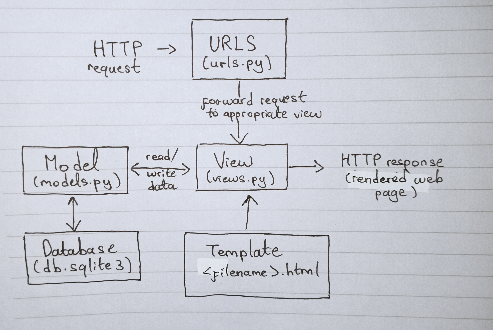

# CakeStock - Pengelolaan Stok Produk pada Toko Kue
### currently being disabled by Adaptable :( 

Nama: Lucinda Laurent<br>
NPM: 2206024745<br>
Kelas: PBP A<br>

<details>
<summary>Tugas 2</summary>

## Checklist Tugas
- [x] Membuat sebuah proyek Django baru. <br>
* Membuat repositori github baru dengan nama "cakestock" dengan visibilitas _public_
* Membuat direktori lokal dengan nama "cakestock" juga lalu membuka _command prompt_ dari dalam direktori tersebut
* Membuat _branch_ utama dengan nama main dengan perintah `git branch -M main`
* Menghubungkan direktori lokal dengan repositori github menggunakan `git remote add origin https://github.com/lucindalaurent/cakestock.git`
* Menambahkan file .gitignore
* Membuat _virtual environment_ dengan perintah `python -m venv env`
* Mengaktifkan _virtual environment_ tersebut dengan perintah `env\Scripts\activate.bat`
* Membuat berkas `requirements.txt` berisi _dependencies_ yang dibutuhkan:
 ```bash
django
gunicorn
whitenoise
psycopg2-binary
requests
urllib3
```
* Meng-_install dependencies_ tersebut dengan perintah `pip install -r requirements.txt`
* Membuat proyek Django bernama `cakestock` dengan perintah `django-admin startproject cakestock .`
* Melakukan konfigurasi proyek dengan menambahkan * pada `ALLOWED_HOSTS` di `settings.py`supaya aplikasi dapat diakses secara luas
* Melakukan `add`, `commit`, dan `push` untuk menyimpan perubahan sementara <br>
- [x] Membuat aplikasi dengan nama `main` pada proyek tersebut.<br>
* Masih di direktori utama, aktifkan _virtual environment_ yang telah dibuat
* Jalankan perintah `python manange.py startapp main` untuk membentuk struktur awal aplikasi
* Daftarkan aplikasi main ke dalam proyek dengan membuka `settings.py`, kemudian tambahkan `main` ke dalam daftar `INSTALLED_APPS`
```bash
INSTALLED_APPS = [
    ...,
    'main',
    ...
]
```
- [x] Melakukan routing pada proyek agar dapat menjalankan aplikasi `main`.<br>
* Membuka berkas `urls.py` dalam direktori proyek `cakestock`.
* Mengimpor fungsi `include`, lalu tambahkan rute url untuk mengarahkan ke tampilan `main`  

```bash
urlpatterns = [
    ...
    path('main/', include('main.urls')),
    ...
]
```
- [x] Membuat model pada aplikasi main dengan nama Item dan memiliki atribut sebagai berikut. <br>
* _name_ sebagai nama item dengan tipe CharField.
* _amount_ sebagai jumlah item dengan tipe IntegerField.
* _description_ sebagai deskripsi item dengan tipe TextField. 
* _price_ sebagai harga item dengan tipe IntegerField (tidak wajib)<br>
Dilakukan dengan membuka models.py pada direktori aplikasi `main` kemudian mengisi file dengan kode:
```bash
from django.db import models
class Item(models.Model):
    name = models.CharField(max_length=255)
    amount = models.IntegerField()
    description = models.TextField()
    price = models.IntegerField()
```
Lalu membuat berkas migrasi berisi perubahan model yang belum diaplikasikan dengan perintah `python manage.py makemigrations`. Berkas migrasi tersebut diterapkan ke dalam basis data lokal menggunakan `python manage.py migrate`

- [x] Membuat sebuah fungsi pada views.py untuk dikembalikan ke dalam sebuah template HTML yang menampilkan nama aplikasi serta nama dan kelas kamu.
* Pada berkas `views.py` ditambahkan fungsi `render_main` untuk me-_render_ tampilan html menggunakan data yang diberikan. 
```bash
from django.shortcuts import render
def render_main(request):
    context = {
        'appname': 'CakeStock',
        'name': 'Lucinda Laurent',
        'class': 'PBP A'
    }

    return render(request, "main.html", context)
```
- [x] Membuat sebuah routing pada urls.py aplikasi main untuk memetakan fungsi yang telah dibuat pada `views.py`. 
* Membuat berkas `urls.py` di dalam direktori `main`.
* Mengisi file tersebut dengan 
```bash
from django.urls import path
from main.views import render_main

app_name = 'main'

urlpatterns = [
    path('', render_main, name='render_main'),
]
```
Sebelum melakukan deployment, saya memastikan untuk melakukan git add, commit, dan push semua perubahan yang saya lakukan pada direktori cakestock.
- [ ] Melakukan deployment ke Adaptable terhadap aplikasi yang sudah dibuat sehingga nantinya dapat diakses oleh teman-temanmu melalui Internet.
* Karena sudah memiliki akun, saya bisa langsung _sign in_ menggunakan akun github proyek.
* Setelah _sign in_, tekan tombol `New App`. Pilih `Connect an Existing Repository.`
* Menghubungkan Adaptable.io dengan GitHub dan memiilih _All Repositories_ pada proses instalasi.
* Memilih repositori proyek cakestock sebagai basis aplikasi yang akan di-deploy
* Memilih Python App Template sebagai template deployment.
* Memilih PostgreSQL sebagai tipe basis data yang akan digunakan.
* Menyesuaikan versi Python dengan spesifikasi aplikasi saya yaitu python 3.11. 
* Pada bagian Start Command masukkan perintah python manage.py `migrate && gunicorn cakestock.wsgi`.
* Memasukkan `CakeStock` sebagai nama aplikasi yang juga akan menjadi nama domain situs web aplikasi.
* Mencentang bagian `HTTP Listener on PORT` dan klik `Deploy App` untuk memulai proses deployment aplikasi. -> belum berhasil deploy

- [x] Membuat sebuah README.md yang berisi tautan menuju aplikasi Adaptable yang sudah di-deploy, serta jawaban dari beberapa pertanyaan berikut. <br>
Tautan menuju aplikasi Adaptable belum tersedia :(

## Buatlah bagan yang berisi request client ke web aplikasi berbasis Django beserta responnya dan jelaskan pada bagan tersebut kaitan antara urls.py, views.py, models.py, dan berkas html.

Penjelasan:
1. Saat _user_ melakukan _request_ ke internet, Django akan menerima http _request_
2. Jika _path_ http _request_ yang diterima ada di dalam `urls.py`,  _request_ akan diteruskan dan memanggil fungsi pada `views.py`.
3. Secara umum, View`(views.py)`akan memproses _request_ sesuai dengan fungsi yang telah definisikan dengan mengambil data dari _database_ `(models.py)` dan menyajikan data tersebut sesuai isi file html di dalam Template(melakukan render template). Selain membaca, View juga bisa menulis atau menambahkan data ke _database_. 
4. Setelah prosesnya selesai, _request_ dari _user_ akan dikembalikan sebagai _response_ yaitu halaman html yang telah di-_render_.

## Jelaskan mengapa kita menggunakan virtual environment? Apakah kita tetap dapat membuat aplikasi web berbasis Django tanpa menggunakan virtual environment? <br>
_Virtual environment_ adalah alat yang membantu memisahkan dependensi yang diperlukan oleh proyek berbeda dengan membuat lingkungan virtual python terisolasi untuk proyek tersebut. Kita menggunakan _virtual environment_ karena penggunaan _virtual environment_ memiliki banyak keunggulan.
Setiap _virtual environment_ memiliki _package_ tersendiri yang terisolasi dari _global package_ maupun _package_ dari _virtual environment_ lainnya. Ini memungkinkan kita untuk memiliki versi _package_ yang berbeda untuk proyek-proyek yang berbeda tanpa khawatir akan adanya konflik. Selain itu, kita dapat membuat file `requirements.txt` yang mencantumkan semua _package_ dan versi yang dibutuhkan oleh proyek kita. Jika seseorang ingin menjalankan kode kita di mesin mereka, mereka hanya perlu membuat _virtual environment_ baru dan menginstal semua paket yang tercantum dalam file `requirements.txt`. Ini memastikan bahwa mereka memiliki semua _dependencies_ yang diperlukan dan dalam versi yang tepat. Oleh karena itu, penggunaan _virtual environment_ sangat membantu dalam kolaborasi dan penyebaran kode. <br>
Ya, kita dapat tetap membuat aplikasi web berbasis Django tanpa menggunakan _virtual environment_. Jika proyek aplikasi web kita sederhana dan tidak bersifat _package-dependent_, kita tidak memerlukan isolasi untuk versi _package_ yang berbeda. Namun jika proyek kita memerlukan _package_ atau _library_ tambahan, sebaiknya kita memang menggunakan _virtual environment_ untuk mengelola _dependencies_ dan mencegah konflik antarversi _package_ yang berbeda. 

## Jelaskan apakah itu MVC, MVT, MVVM dan perbedaan dari ketiganya. <br>
MVC, MVT, dan MVVM adalah macam-macam pola desain populer dalam pengembangan perangkat lunak yang digunakan untuk memisahkan logika aplikasi menjadi komponen-komponen yang berbeda.
1. MVC: Model-View-Controller 
* Model: komponen yang berisi tentang logika bisnis dan status data yang ada di dalam aplikasi. Komponen ini bertugas untuk mendapatkan dan memanipulasi data, berkomunikasi dengan Controller, berinteraksi dengan database, terkadang memperbarui tampilan dari aplikasi yang dikembangkan.<br>
* View: komponen yang berhubungan dengan antarmuka pengguna, biasanya terdiri dari HTML/CSS.XML. View berkerja sama dengan Controller untuk menciptakan tampilan dinamis pada aplikasi yang dikembangkan. Selain bertugas untuk menangani antarmuka dan interaksi pengguna, komponen View juga memiliki tugas untuk menyajikan data yang sesuai untuk pengguna.<br>
* Controller: komponen yang berfungsi sebagai komunikator antara View dan model. Komponen ini membutuhkan suatu input pengguna dari layanan View/REST. Lalu Permintaan “Get Data” diproses dari model dan diteruskan ke View untuk ditampilkan ke pengguna.<br>
2. MVT: Model-View-Template
MVT adalah variasi dari pola MVC yang digunakan oleh Django. Dalam MVT, “Template” adalah apa yang disebut “View” dalam MVC, dan “View” dalam MVT adalah apa yang disebut “Controller” dalam MVC. Dalam MVT, View bertanggung jawab untuk menangani permintaan dan logika bisnis, sementara Template bertanggung jawab untuk menampilkan data kepada pengguna. <br>
3. MVVM: Model-View-ViewModel
* Model: Model yang digunakan untuk MVVM mirip dengan model yang digunakan MVC, dimana model tersebut terdiri dari data dasar yang digunakan untuk menjalankan perangkat lunak.<br>
* View: View digunakan sebagai antarmuka grafis antara pengguna dan pola desain, serta menampilkan output dari data yang telah diproses. View yang digunakan MVVM mirip dengan View yang digunakan dalam MVC. View pada MVVM juga menangani input user. <br>
* ViewModel: ViewModel di satu sisi adalah abstraksi dari View, lalu di sisi yang lain, sebagai penyedia pembungkus data model untuk ditautkan. ViewModel terdiri dari Model yang diubah menjadi View, dan berisi perintah yang dapat digunakan oleh View untuk memengaruhi Model.
<br>
</details>

# Tugas 3
- [x] Jawaban Pertanyaan <br>
## Apa perbedaan antara form POST dan form GET dalam Django? <br>
Dalam Django, form POST dan GET memiliki perbedaan dalam cara mengirimkan data. Saat menggunakan form POST, browser menggabungkan data formulir, mengkodekannya untuk transmisi, mengirimkannya ke server, dan kemudian menerima kembali responsnya. Form POST digunakan ketika data yang dikirimkan akan mengubah database di server. Misalnya saat pengguna mengisi form pendaftaran atau login yang memerlukan password. Sedangkan form GET digunakan untuk form yang tidak mengubah data pengguna, seperti form pencarian. Metode ini menggabungkan data yang dikirimkan menjadi string dan menggunakan string tersebut untuk membuat URL. URL akan berisi alamat tujuan pengiriman data, serta _keys_ dan _values_ dari data. Hal ini ditandai dengan adanya parameter dalam URL, seperti "?query=search_term". Dengan demikian, form POST lebih aman dari GET karena data yang dikirimkan tidak terlihat dalam URL. Artinya data tersebut tidak akan disimpan dalam log server atau riwayat browser. Sebaliknya, form GET mengirimkan data melalui URL, yang berarti data tersebut bisa terlihat oleh siapa saja yang melihat URL dan bisa disimpan dalam log server atau riwayat browser. Oleh karena itu, form GET cocok digunakan untuk form pencarian web karena URL yang mewakili permintaan GET dapat dengan mudah di-bookmark, dibagikan, atau dikirim ulang. <br>

## Apa perbedaan utama antara XML, JSON, dan HTML dalam konteks pengiriman data? <br>
JSON dan XML adalah representasi data yang digunakan dalam pertukaran data antaraplikasi.
1. XML (eXtensible Markup Language):
* XML adalah bahasa markup yang digunakan untuk membuat dokumen yang dapat dibaca oleh manusia maupun mesin.
* XML biasanya digunakan untuk mengirim data yang kompleks dan sangat terstruktur seperti dokumen atau laporan keuangan.
* XML merepresentasikan item data menggunakan tag dan membentuk struktur pohon dengan _namespace_ untuk kategori data yang berbeda.
* Saat menggunakan XML, kita perlu mengambil dokumen XML, menggunakan DOM XML untuk melakukan loop pada dokumen, dan mengekstrak nilai untuk disimpan dalam variabel.
* XML tidak mendukung penggunaan _array_
* Struktur tag XML lebih kompleks untuk ditulis dan dibaca sehingga menghasilkan file yang memakan banyak ruang.
* Struktur XML rentan terhadap modifikasi yang tidak sah dan deklarasi tipe dokumen eksternal (external document type declaration/DTD) yang tidak terstruktur. 

2. JSON (JavaScript Object Notation):
* JSON adalah format pertukaran data menggunakan teks yang dapat dibaca baik oleh manusia maupun mesin.
* JSON umumnya merupakan pilihan yang lebih baik untuk API, aplikasi seluler, dan penyimpanan data.
* JSON merepresentasikan data sebagai objek yang berisi pasangan _attribute-value_
* Saat menggunakan JSON, kita perlu mengambil string JSON dan menggunakan JSON.parse() untuk mengurai string JSON.
* JSON mendukung penggunaan _array_
* JSON memiliki ukuran file yang lebih kecil dan transmisi data yang lebih cepat.
* Selain terkesan ringan dan mudah digunakan, JSON memiliki keamanan data yang lebih baik dibandingkan XML.

3. HTML (HyperText Markup Language):
* HTML adalah bahasa markup standar untuk dokumen yang dirancang untuk ditampilkan di browser web.
* HTML tidak dirancang untuk menyimpan data. Sebaliknya, HTML digunakan untuk menampilkan data dan fokus pada bagaimana data terlihat dan disajikan.
* HTML menggunakan tag untuk menentukan bagaimana konten ditampilkan dalam browser web.
#### Dalam konteks pengiriman data, XML dan JSON digunakan untuk menyimpan dan mengirim data, sementara HTML digunakan untuk menampilkan data. XML dan JSON digunakan saat data perlu dikirim dari server ke klien atau sebaliknya, sementara HTML digunakan untuk menampilkan data tersebut ke pengguna.<br>

## Mengapa JSON sering digunakan dalam pertukaran data antara aplikasi web modern? <br>
Meningkatnya popularitas JavaScript turut meningkatkan popularitas JSON. Banyak pengembang yang bekerja dengan JavaScript lebih memilih sintaks JSON yang mudah dibaca daripada struktur XML yang kompleks. Selain itu, JSON lebih mudah diurai daripada XML. Kita dapat mengurai file JSON menjadi objek siap pakai yang dapat dibaca oleh manusia dan mesin. Berikut adalah kelebihan JSON yang menjadi alasan JSON sering digunakan:
1. **Ringan dan efisien**: JSON adalah format pertukaran data yang ringan, memungkinkan pertukaran data yang cepat dan efisien antara server dan klien.
2. **Mudah dibaca dan dipahami**: JSON mudah dibaca oleh manusia dan mesin, yang memudahkan pengembangan dan debugging.
3. **Struktur data fleksibe**l: JSON dapat merepresentasikan berbagai jenis data, termasuk tipe data dasar seperti string, angka, boolean, serta struktur yang lebih kompleks seperti objek dan array.
4. **Kompatibilitas lintas platform**: JSON didukung oleh sebagian besar bahasa pemrograman modern, memungkinkan data dalam format JSON dapat dengan mudah diolah dan dimanipulasi di berbagai platform dan lingkungan.  
5. **Ideal untuk API**: JSON bersifat independen dari setiap bahasa pemrograman dan merupakan output API umum dalam berbagai aplikasi. JSON sering digunakan pada API karena strukturnya yang sederhana dan mudah dipahami. <br>

## Jelaskan bagaimana cara kamu mengimplementasikan checklist secara step-by-step.
- [x] Membuat input form untuk menambahkan objek model pada app sebelumnya.
Sebelum kita membuat form, kita perlu membuat suatu _skeleton_ yang berfungsi sebagai kerangka _views_ untuk memastikan adanya konsistensi dalam desain situs web kita, serta memperkecil kemungkinan terjadinya redundansi kode. 
1. Membuat folder `templates` pada root folder dan membuat sebuah berkas HTML baru bernama `base.html` dengan isi sebagai berikut
```

<!DOCTYPE html>
<html lang="en">
    <head>
        <meta charset="UTF-8" />
        <meta
            name="viewport"
            content="width=device-width, initial-scale=1.0"
        />
        
        
    </head>

    <body>
        
        
    </body>
</html>
```
2. Mengedit `TEMPLATES` pada file `settings.py` di subdirektori `cakestock` agar file `base.html` terdeteksi sebagai file template
```
...
TEMPLATES = [
    {
        'BACKEND': 'django.template.backends.django.DjangoTemplates',
        'DIRS': [BASE_DIR / 'templates'], # Tambahkan kode ini
        'APP_DIRS': True,
        ...
    }
]
...
```
Selanjutnya kita sudah bisa mulai membuat form
1. Membuat berkas baru pada direktori `main` dengan nama `forms.py` untuk membuat struktur form yang dapat menerima data item baru. Isi dari `forms.py`adalah 
```
from django.forms import ModelForm
from main.models import Item

class ItemForm(ModelForm):
    class Meta:
        #Ketika data dari form disimpan, isi dari form akan disimpan menjadi sebuah objek Item
        model = Item
        #Field/atribut dari object Item
        fields = ["name", "amount", "description", "price"]

```
2. Mengupdate berkas `views.py` pada folder `main`: 
* Menambahkan import
```
from django.http import HttpResponseRedirect
from main.forms import ProductForm
from django.urls import reverse
```
* Menambahkan fungsi `create_item`
```
def create_item(request):
    form = ItemForm(request.POST or None)

    if form.is_valid() and request.method == "POST":
        form.save()
        return HttpResponseRedirect(reverse('main:render_main'))

    context = {'form': form}
    return render(request, "create_item.html", context)
```
* Mengedit fungsi `render_main` menjadi seperti di bawah
```
def render_main(request):
    items = Item.objects.all()
    
    context = {
        'appname': 'CakeStock',
        'name': 'Lucinda Laurent',
        'class': 'PBP A',
        'items': items
    }

    return render(request, "main.html", context)
```
3. Mengimpor fungsi `create_item` pada `urls.py` di folder `main`
4. Menambahkan _path url_ ke dalam `urlpatterns` pada `urls.py` di `main` untuk mengakses fungsi `create_item`
```
path('create-item', create_item, name='create_item')
```
5. Membuat berkas HTML baru dengan nama `create_item.html` pada direktori `main/templates` yang berisi
```
 


<h1>Add New Item</h1>

<form method="POST">
    
    <table>
        {{ form.as_table }}
        <tr>
            <td></td>
            <td>
                <input type="submit" value="Add Item"/>
                
            </td>
        </tr>
    </table>
</form>


```
6. Menambahkan kode berikut di dalam  pada `main.html` untuk menampilkan data produk pada html dalam bentuk tabel serta tombol "Add New Item" yang akan redirect ke halaman form.
```
...
<table border="1">
    <tr>
        <th>Name</th>
        <th>Amount</th>
        <th>Description</th>
        <th>Price</th>
    </tr>

     Berikut cara memperlihatkan data produk di bawah baris ini 

    
    <tr>
        <td>{{item.name}}</td>
        <td>{{item.amount}}</td>
        <td>{{item.description}}</td>
        <td>{{item.price}}</td>
    </tr>
    
</table>

<br />

<a href="">
    <button>
        Add New Item
    </button>
</a>

```
- [x] Tambahkan 5 fungsi views untuk melihat objek yang sudah ditambahkan dalam format HTML, XML, JSON, XML by ID, dan JSON by ID.
1. Fungsi views untuk menampilkan data objek pada html sudah dihandle oleh fungsi `render_main`
2. Mengimpor module dan class yang dibutuhkan
```
from django.http import HttpResponse
from django.core import serializers
```
3. Menambahkan fungsi-fungsi berikut pada `views.py` di folder `main`:
* Fungsi `show_xml`
```
def show_xml(request):
    data = Item.objects.all()
    return HttpResponse(serializers.serialize("xml", data), content_type="application/xml")
```
* Fungsi `show_json` 
```
def show_json(request):
    data = Item.objects.all()
    return HttpResponse(serializers.serialize("json", data), content_type="application/json")
```
* Fungsi `show_xml_by_id`
```
def show_xml_by_id(request, id):
    data = Item.objects.filter(pk=id)
    return HttpResponse(serializers.serialize("xml", data), content_type="application/xml")
```
* Fungsi `show_json_by_id`
```
def show_json_by_id(request, id):
    data = Item.objects.filter(pk=id)
    return HttpResponse(serializers.serialize("json", data), content_type="application/json")
```
- [x] Membuat routing URL untuk masing-masing views yang telah ditambahkan.
1. Mengimpor semua fungsi views yang telah dibuat ke `urls.py` pada folder `main`
```
from main.views import render_main, create_item, show_xml, show_json, show_xml_by_id, show_json_by_id 
```
2. Menambahkan _path url_ ke dalam `urlpatterns` untuk mengakses fungsi yang sudah diimpor tadi.
```
...
    path('xml/', show_xml, name='show_xml'), 
    path('json/', show_json, name='show_json'),
    path('xml/<int:id>/', show_xml_by_id, name='show_xml_by_id'),
    path('json/<int:id>/', show_json_by_id, name='show_json_by_id')
```

## Mengakses kelima URL di poin 2 menggunakan Postman, membuat screenshot dari hasil akses URL pada Postman
### Hasil akses HTML

### Hasil akses XML

### Hasil akses JSON

### Hasil akses XML by ID

### Hasil akses JSON by ID


